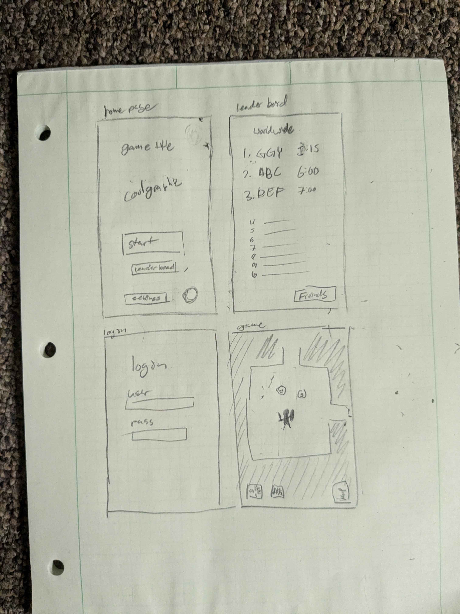

# startup
repo for cs260. woo
this is a game that i programmed for a class, have fun playing it

## Elevator pitch:
I am making a procedurally generated rouge-like game with a focus on speed running. The game will be built using JavaScript and React. It’ll have a built-in speed running leaderboard, and a separate leaderboard for your friends, if you have logged in. you need to be logged in to post to the leader board.

## Features:
Log in/sign up

Play the game

Add/remove friends

Share/view high scores

## Description of technologies
- **HTML** - Uses correct HTML structure for application. The HTML pages. One for start page, current leaderboard, one for login, one for adding friends, and one for the game. Hyperlinks to choice artifact.
-	**CSS** - Application styling that looks good on different screen sizes, uses good whitespace, color choice and contrast.
-	**JavaScript** - Provides login, the game, displays current leaderboard, backend endpoint calls.
- **React** – Multi page application with views componentized and reactive to user's actions.
-	**Service** - Backend service with endpoints for:
    -	Loggin in
    -	Submitting a high score
    -	retrieving high score data
    -	retrieving friend data
-	**DB/Login** - Store users, user’s friends, and scores in database. Register and login users. Credentials securely stored in database.
-	**WebSocket** - As a new leaderboard score is reached (friends or public), it will be broadcasted.

## rough sketch of pages

