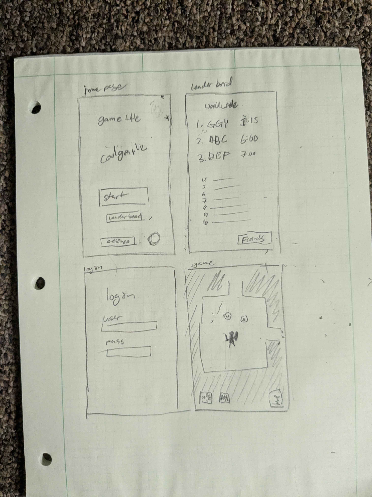

# startup
repo for cs260. woo

this is a game that i programmed for a class, have fun playing it

disclaimer: i work as a web developer for the mtc, my notes may be sparse

# startup login

we are now connected to the database. the database holds all the user data so that when the server restarts nothing will be lost. users, scores, and friendcodes are stored back there.

# startup service

now you can log in, logout, have an account, and save scores. the 3rd party api grabs a random image of a cat on the settings page if you click get random cat. this breaks the css sometimes when too large of an image is loaded

# startup react

its now in react. i learn a lot in how to pass data around with event handlers. that, and debugged alot. i havent really programmed in react before

# startup css

i added dynamic resizing and colored the background and buttons to help with the vibe of the game that i want to create. i prefer the look of rounded buttons so i rounded all my menu buttons. i also added arrow buttons that appear in the play page for users on mobile

# Startup html

i need 6 pages, the login page, game-home page, the friend page, the game page, the settings page, and the game over page. i have added links in buttons so that they all connect to each other as they should.

i added divs for stylization/spacing in startup css

## Elevator pitch:
I am making a procedurally generated rouge-like game with a focus on speed running. The game will be built using JavaScript and React. It’ll have a built-in speed running leaderboard, and a separate leaderboard for your friends, if you have logged in. you need to be logged in to post to the leader board.

## Features:
Log in/sign up

Play the game

Add/remove friends

Share/view high scores

## Description of technologies
- **HTML** - Uses correct HTML structure for application. The HTML pages. One for start page, current leaderboard, one for login, one for adding friends, and one for the game. Hyperlinks to choice artifact.
-	**CSS** - Application styling that looks good on different screen sizes, uses good whitespace, color choice and contrast.
-	**JavaScript** - Provides login, the game, displays current leaderboard, backend endpoint calls.
- **React** – Multi page application with views componentized and reactive to user's actions.
-	**Service** - Backend service with endpoints for:
    -	Loggin in
    -	Submitting a high score
    -	retrieving high score data
    -	retrieving friend data
-	**DB/Login** - Store users, user’s friends, and scores in database. Register and login users. Credentials securely stored in database.
-	**WebSocket** - As a new leaderboard score is reached (friends or public), it will be broadcasted.

## rough sketch of pages

